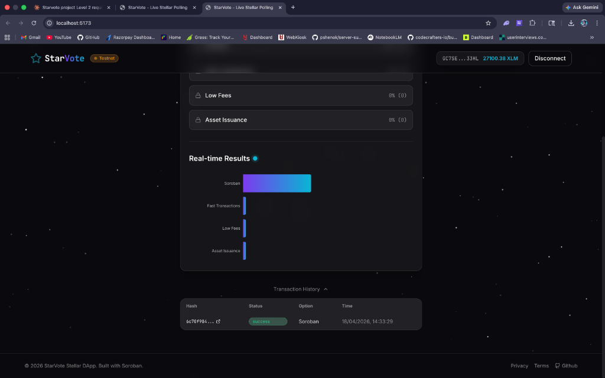

# 🌟 StarVote

<p align="center">
  <strong>A modern, decentralized live polling application built on the Stellar Testnet with Soroban smart contracts.</strong>
</p>

## ✨ What is StarVote?

StarVote allows users to participate in transparent, immutable, and on-chain polls using their Stellar wallets. It features a cosmic glassmorphism UI, real-time vote tracking via event streaming, and robust smart contract interactions.

## 📸 Screenshots




**Live Demo**: [Will be deployed to Vercel soon]()

## 🛠 Setup Instructions

1. **Clone the repository**
   ```bash
   git clone https://github.com/your-username/starvote.git
   cd starvote
   ```

2. **Install Dependencies**
   ```bash
   npm install
   ```

3. **Configure Environment Variables**
   Copy `.env.example` to `.env` and fill in the required variables (like the `VITE_CONTRACT_ID`).
   ```bash
   cp .env.example .env
   ```

4. **Run the Development Server**
   ```bash
   npm run dev
   ```
   Open `http://localhost:5173` to view the app!

## 🦀 Contract Deployment

Ensure you have the Rust toolchain installed, `soroban-cli` set up, and an account funded on the Stellar testnet.

1. **Build the Contract**
   Navigate to the `contracts/poll` folder and run:
   ```bash
   cargo build --target wasm32-unknown-unknown --release
   ```

2. **Deploy**
   Use `soroban-cli` to deploy the optimized wasm file:
   ```bash
   soroban contract deploy \
     --file target/wasm32-unknown-unknown/release/soroban_poll_contract.wasm \
     --source <your-funded-testnet-account> \
     --network testnet
   ```

3. **Initialize the Poll**
   Call the `initialize` function to set up your poll question and choices:
   ```bash
   soroban contract invoke \
     --id <YOUR_NEW_CONTRACT_ID> \
     --source <your-funded-testnet-account> \
     --network testnet \
     -- \
     initialize \
     --admin <your-address> \
     --question "What is the best blockchain network?" \
     --options '["Stellar", "Ethereum", "Solana", "Polkadot"]'
   ```

**Deployed Contract Address**: `CB64QXAYTZ6MEFENXBDX3QLRGA7V7EYVQ775KLFQQSVQYQJKQ6Q3D6I7`
**Transaction Hash**: [`ac097c640e4d0b30b5f2d828962eedb66e2e7cecf890444abe20c376972d4b4e`](https://stellar.expert/explorer/testnet/tx/ac097c640e4d0b30b5f2d828962eedb66e2e7cecf890444abe20c376972d4b4e)


## ⚙️ Environment Variables (`.env.example`)

```env
VITE_CONTRACT_ID=CXXXXXXXXXXXXXXXXXXXXXXXXXXXXXXXXXXXXXXXXXXXXXXXXXXXXXXXXXXXXXXXX
VITE_NETWORK_PASSPHRASE=Test SDF Network ; September 2015
VITE_SOROBAN_RPC_URL=https://soroban-testnet.stellar.org
VITE_HORIZON_URL=https://horizon-testnet.stellar.org
```

## 🚀 Tech Stack

- **Frontend**: React + Vite + TypeScript
- **Styling**: Tailwind CSS v3 + custom glassmorphism design system
- **Stellar SDK Integration**: `@stellar/stellar-sdk` & `@creit.tech/stellar-wallets-kit`
- **Smart Contract**: Soroban (Rust)
- **State Management**: Zustand
- **Animations**: Framer Motion
- **Data Visualization**: Recharts

## 📄 License

MIT License.
# starvote
